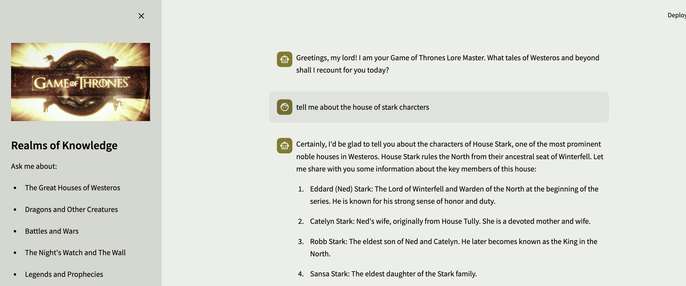

# Game of Thrones Lore Master Chatbot

## Project Overview

This project is a creation of an intelligent chatbot focused on the world of Game of Thrones, based on a Neo4j knowledge graph and books from the A Song of Ice and Fire series. The chatbot, acting as a Lore Master from the Citadel, provides detailed information about characters, houses, events, and the rich lore of Westeros and beyond.

In the first phase of the project, information from the books is translated into a knowledge graph using the langchain_experimental (graph_transformers package). This graph is then loaded into Neo4j AuraDB, where it can be queried using CYPHER queries.

The graph serves as the foundation for a chatbot with an agent that can perform several types of queries:
- RAG-style queries on the base documents
- Complex CYPHER queries on the knowledge graph created in the first phase

The bot stores its memory in Neo4j AuraDB, allowing analysis of past questions and answers, and formulating insights about the users' interests in the Game of Thrones universe.

An example from the knowledge graph, the results of the following query (Partial screenshot):
```cypher
MATCH (h:House)<-[r:MEMBER_OF]-(c:Character)
WHERE h.name IN ['Stark', 'Lannister', 'Targaryen']
RETURN h, c, r
```


An example of the chat-bot's response in the Streamlit interface:


## Setup

1. **Create a Virtual Environment**
   To create a virtual environment, run the following command:
   ```bash
   python -m venv venv
   ```

2. **Install the Requirements**
   Activate the virtual environment and install the required packages by running:
   ```bash
   source venv/bin/activate # On Windows use `venv\Scripts\activate`
   pip install -r requirements.txt
   ```

3. **Create the .env File**
   Create a `.env` file with the necessary passwords and configurations, following the format provided in `example_env.txt`.

## Knowledge Graph Creation

1. **Add Files to the Books Directory**
   Place the Game of Thrones books into a directory, and change the "PATH" variable in `Insert_to_the_graph.py` to the directory path. We use the `books` directory.

2. **Update config.py file**
   Update the node and relationship types allowed in the `config.py` file to match Game of Thrones entities (e.g., Character, House, Location).

3. **Run the Insert_to_the_graph Script**
   Extract nodes and upload them to AuraDB by running:
   ```bash
   python Insert_to_the_graph.py
   ```

4. **Run the clean_graph Script**
   Clean up irrelevant relationships by running:
   ```bash
   python clean_graph.py
   ```

## Document Index Creation

1. **Run the create_doc_vector_index Script**
   Create the document vector index for efficient text search by running:
   ```bash
   python create_doc_vector_index.py
   ```

## Running the Bot

1. **Run the bot Script**
   To start the Game of Thrones Lore Master chatbot, run:
   ```bash
   streamlit run bot.py
   ```

Enjoy exploring the vast world of Ice and Fire with your new AI Maester!